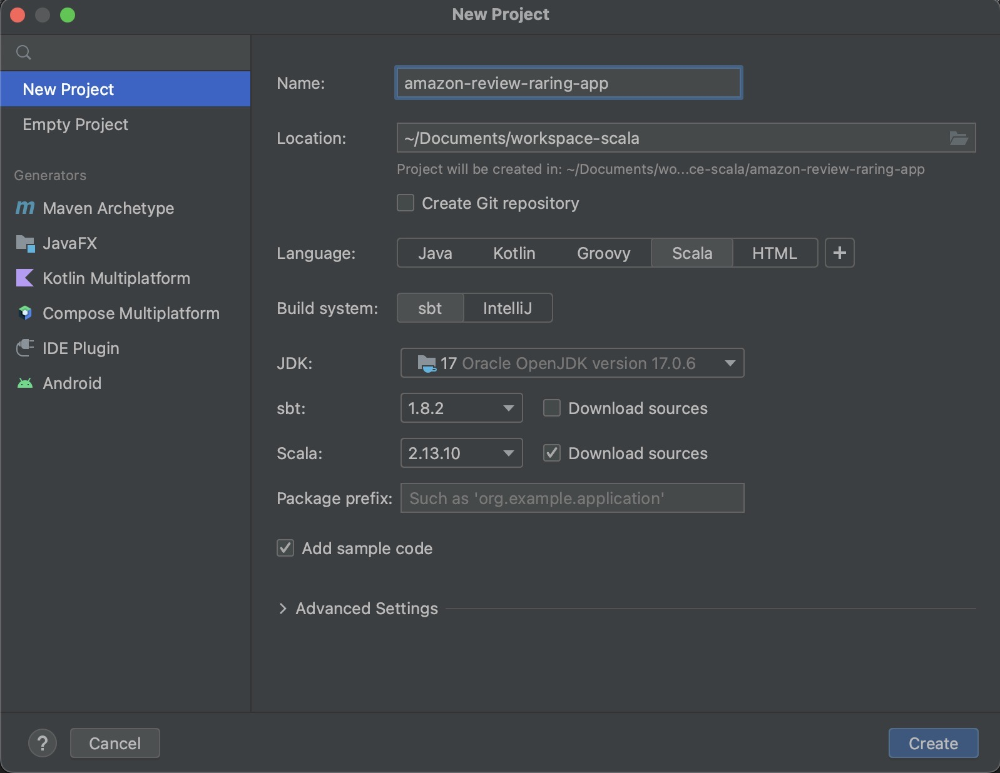
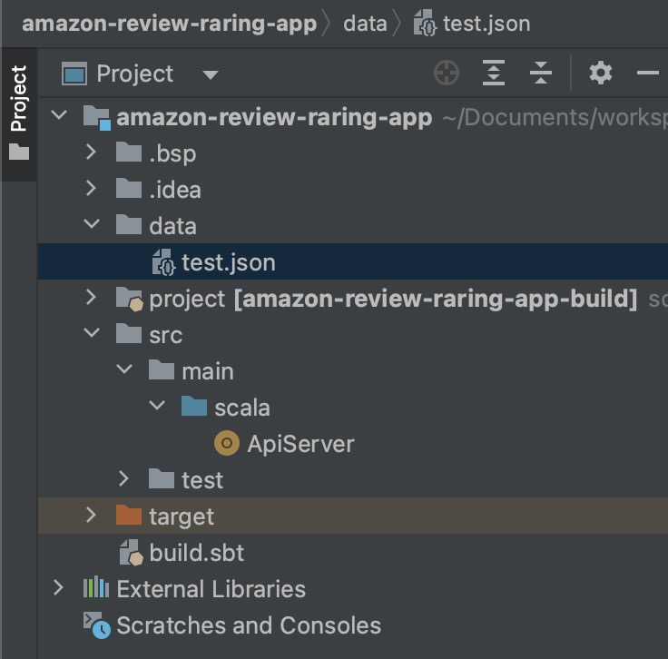

<!-- PROJECT Title -->
<br />
<div align="center">
  <div>
    
    
  </div>
  <br>
  <h2>Scala Coding Challenge</h2>
  <h3>Amazon review Rating API</h3>
  From <a href="https://github.com/HivemindTechnologies/scala-coding-challenge">https://github.com/HivemindTechnologies/scala-coding-challenge</a>
</div>
<br>
<!-- TABLE OF CONTENTS -->
<details>
  <summary>Table of Contents</summary>
  <ol>
    <li>
      <a href="#about-the-project">About The Project</a>
    </li>
    <li>
      <a href="#getting-started">Getting Started</a>
      <ul>
        <li><a href="#prerequisites">Prerequisites</a></li>
        <li><a href="#installation">Installation</a></li>
      </ul>
    </li>
    <li><a href="#contact">Contact</a></li>
  </ol>
</details>

<!-- ABOUT THE PROJECT -->
## About The Project
Tis project is based on the <a href="https://github.com/HivemindTechnologies/scala-coding-challenge">this repo</a> but using ***GET request***.

An API, which takes the request from client, and returns the ***best reviewed product and average rating*** according to the requirements, which contain ***time period, minimal reviews and amount of products***.

Here is how it working: 
1. The data path will given as an parameter when starting the http server, and data will be read after server started.
2. Client sends request to server with json.
3. Server extracts the requirements, filter the data and send response.

<p align="right">(<a href="#readme-top">back to top</a>)</p>

<!-- GETTING STARTED -->
## Getting Started
The repo contains only necessary files, you can download and run the API in your computer.

### Prerequisites
In order to run the project, you need to have java, scala, spark and sbt installed.
The IntelliJ IDE is used in this project.

### Installation
1. Download these 3 files: ***ApiServer.scala, build.sbt and test.json***
2. Open a new scala project in IntelliJ
{height=400}
3. Put the downloaded files to the right location
{height=200}
4. Use terminal to start Http-Server 
```sh
sbt compile
sbt "run data/test.json" 
```
5. Use another terminal to send request
```sh
  curl -X GET \
  http://localhost:8080/ \
  -H 'Content-Type: application/json' \
  -d '{
  "start": "01.01.2010",
  "end": "31.12.2020",
  "limit": 2,
  "min_number_reviews": 2
  }'
```
6. Get the result
```sh
[{"asin":"B000JQ0JNS","average_rating":4.5},
{"asin":"B000NI7RW8","average_rating":3.6666666666666665}]
```

<p align="right">(<a href="#readme-top">back to top</a>)</p>

<!-- CONTACT -->
## Contact

Hsinyu Chen - [@linkedIn](https://www.linkedin.com/in/hsinyu-chen-4b43b489/) - [@email](chenxinyu.tw@gmail.com)

<p align="right">(<a href="#readme-top">back to top</a>)</p>

<!-- MARKDOWN LINKS & IMAGES -->
<!-- https://www.markdownguide.org/basic-syntax/#reference-style-links -->
[linkedin-url]: https://www.linkedin.com/in/hsinyu-chen-4b43b489/
[new-project]: images/new-project.jpeg
[project-structure]: images/project-structure.jpeg
[http-server]: http-server.jpeg
[curl]: images/curl.jpeg


